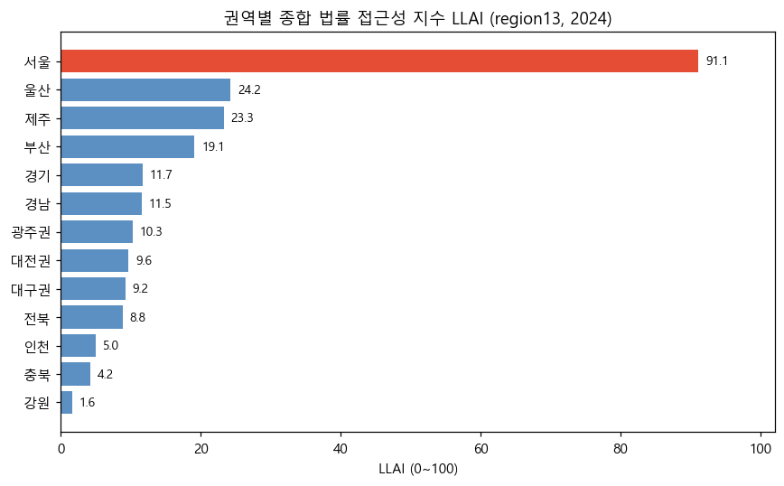
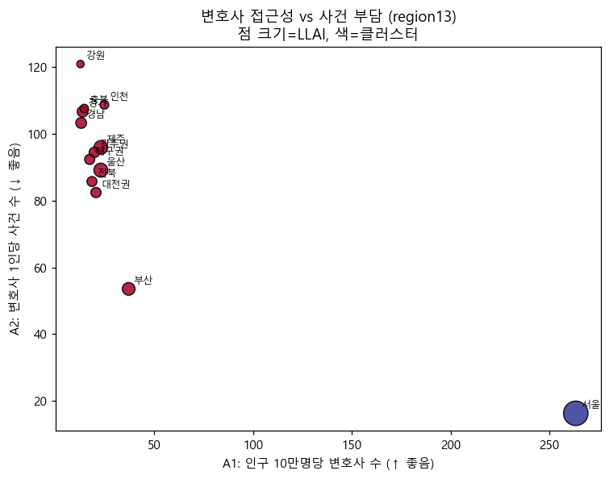
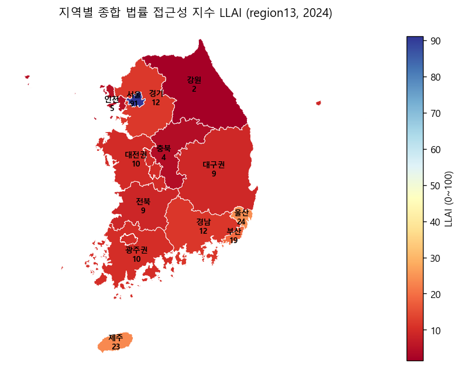
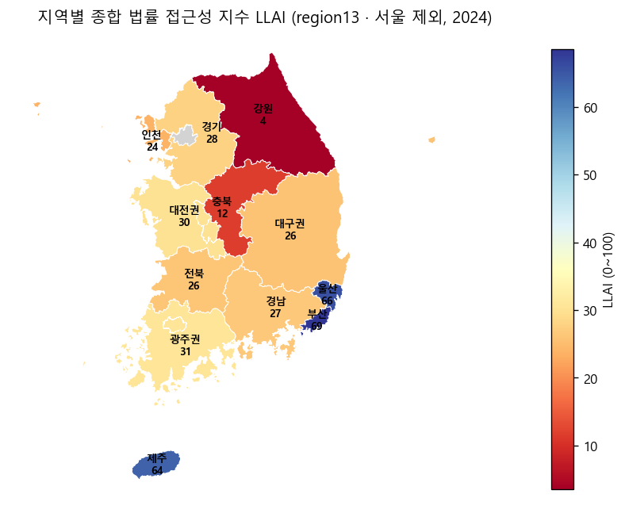
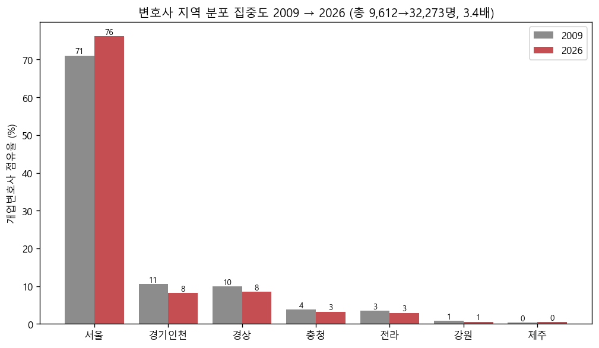
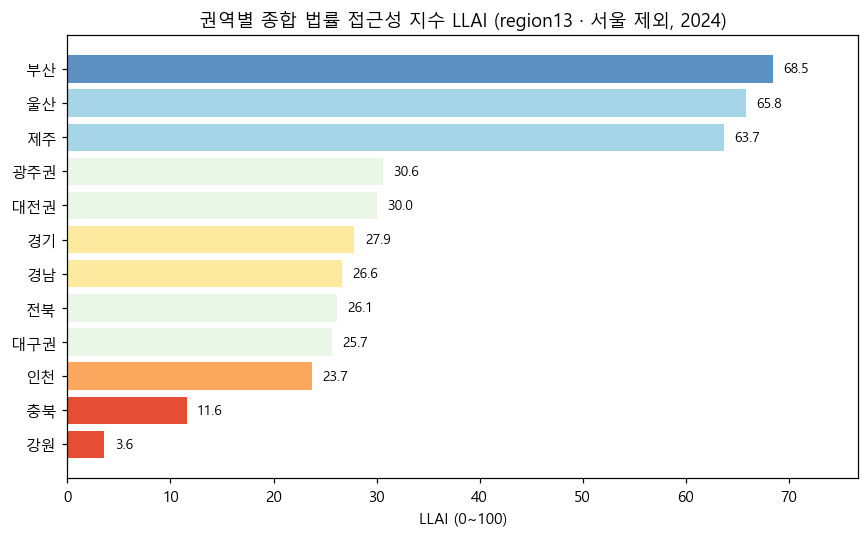

# 대한민국 법률 서비스 접근성 불균형 분석
## 지역별 종합 법률 접근성 지수(LLAI) 개발 및 격차 탐색

서강대학교 26-1학기 빅데이터컴퓨팅(BDS3010) 최종 보고서 · 20210717 김찬우

---

## 한 눈에 보기

| 항목 | 내용 |
|---|---|
| **문제** | 변호사·법원·법률구조 자원의 **지역별 접근성 불균형**을 정량화하고 구조를 규명 |
| **방법** | 3개 차원(A1 변호사·A2 사건부담·A3 취약계층)을 단일 지수 **LLAI(0~100)** 로 통합 |
| **데이터** | 변협·사법연감·법률구조공단·KOSIS (분석 단위: 13권역·10도단위, 기준연도 2024) |
| **핵심 발견** | ① 서울 일극 집중(LLAI 91 vs 나머지 2~24) ② 변호사↑→사건부담↓(r=−0.85, H2) ③ '수도권 우위'는 사실상 **서울 단독**(서울 제외 시 부산·울산·제주 상위, 인천은 하위) ④ 변호사 **3.4배↑에도 서울 집중 71%→76% 심화**(H4) |
| **결론** | 단순 수도권/비수도권이 아니라 **인구 대비·사건부담**이 접근성을 좌우. 양적 팽창만으로는 격차가 해소되지 않음 |

> 코드·노트북·인터랙티브 지도: [github.com/Allenkeem/llai-project](https://github.com/Allenkeem/llai-project)

---

## 요약 (Abstract)

변호사 분포·법원 사건부담·취약계층 접근성의 3개 차원을 단일 **종합 법률 접근성 지수(LLAI)** 로 통합하여, 대한민국 지역별 법률 서비스 접근성 불균형을 정량화하였다. 출처별 지역 해상도 차이를 반영해 **13개 권역(region13)과 10개 도단위(region10)** 두 단위로 분석했다(기준연도 2024).

분석 결과 **서울의 일극 집중**이 격차를 지배했으며(LLAI 91, 인구 10만 명당 변호사 263명), 변호사 수와 사건부담은 강한 음의 상관(H2, r=−0.84~−0.88)을 보였다. 서울을 제외하고 재정규화하면 **부산·울산·제주**가 상위로 부상하고 인구가 큰 인천·경기는 중하위로 내려가, '수도권 우위'가 사실상 **서울 단독 현상**임이 드러났다. 또한 로스쿨 도입 이후 변호사가 **3.4배** 늘었음에도 서울 집중은 **71%→76%** 로 심화되어(H4), 양적 팽창이 지역 격차 해소로 이어지지 않았음을 확인했다.

---

## 1. 서론

### 1.1 배경 및 필요성
로스쿨 제도 도입(2009) 이후 변호사 수는 빠르게 증가해 2025년 등록 변호사가 4만 명을 넘어섰다. 그러나 법률 서비스 자원의 지역 편중은 심화되고 있다는 지적이 꾸준히 제기되어 왔다. 법률 서비스 접근성의 지역 불균형은 단순한 자원 배분 문제가 아니라 사법 정의 실현과 직결되는 사회 문제다. 본 연구는 데이터 기반 분석으로 **어느 지역이 법적 보호에서 소외되는지** 를 정량적으로 규명한다.

### 1.2 연구 문제와 가설
> 대한민국 지역별 법률 서비스 접근성 불균형은 어느 정도이며, 그 구조적 원인은 무엇인가?

- **H1** 수도권 변호사 1인당 인구 < 비수도권 (접근성 유리)
- **H2** 변호사가 적은 권역일수록 변호사 1인당 사건 부담이 높다
- **H3** 소득이 낮을수록 법률구조 수요는 높으나 자원은 부족하다
- **H4** 로스쿨 도입 이후 변호사 증가에도 지역 격차는 줄지 않았다

### 1.3 연구 범위 및 선행연구 차용
본 연구는 26-1학기 빅데이터컴퓨팅 **기말 프로젝트로 직접 수행**한 결과물이다.
- **선행연구(타인) 차용 없음** — LLAI 지수 설계, 데이터 수집·정제 코드, 분석·시각화는 전부 자체 개발했다.
- **본인 이전 연구 차용 없음** — 분석 주제와 방법론 골격은 본 과목 제안서에서 직접 설계한 것이며, 실제 데이터 수집·구현·분석·해석은 이번 기말 프로젝트에서 수행했다.
- 외부에서 가져온 것은 **공개 raw data와 경계 파일**뿐이며 모두 출처를 명시했다: KOSIS·대법원 사법연감·법률구조공단·대한변협 공공데이터, 시도경계 GeoJSON(southkorea-maps), 2009년 변호사 분포(법률저널 2010 보도 인용, H4 비교 기준점).

즉 데이터는 공개 출처에서 차용했으나, **수집·정제·지수 개발·분석·해석은 100% 본 프로젝트에서 수행**했다.

**선행연구와의 관계(중요).** 위의 '차용 없음'은 *타인의 결과물을 복제하지 않았다*는 학술 윤리 측면이며, **선행연구가 없다는 뜻이 아니다.** 법률서비스 접근성·변호사 지역격차에는 사법정책연구원·법률구조공단 보고서, 변호사 정원 증가의 접근성 효과 연구(서울대 등) 등 **기존 연구가 분명히 존재한다.** 본 지수의 핵심 지표(인구 10만 명당 변호사 수)도 이들이 쓰는 표준 지표를 따른다. 다만 본 연구는 이 표준 위에 **3개 차원 통합지수(LLAI)와 다출처 자동화 파이프라인**을 더한 것이며, **기존 지수와의 정량적 벤치마킹은 수행하지 못한 한계**가 있다(향후 과제).

---

## 2. 데이터와 방법

전체 분석은 아래 파이프라인으로 진행된다. 각 단계는 `src/`의 모듈로 구현되어 재현 가능하다.


### 2.1 데이터 규모와 성격 — 얼마나 '빅'데이터인가

원천 데이터의 형식과 규모는 다음과 같다(실측).

| 출처 | 형식 | 규모 | 기간 |
|---|---|---|---|
| 사법연감(법원) | 엑셀 19파일·다중시트 | **약 140만 셀** (민사 1파일이 111만 셀, 21시트) | 2024 |
| KOSIS 기초수급자 | CSV (시도×성별×연령×연도) | 6,589행 × 22열 | 2009~2024 |
| KOSIS 인구·GRDP | CSV 가로형(다중헤더) | 각 20행 × 55~61열 | 2008~2025 |
| 공단 법률구조 | 엑셀(반기) | 민사·형사 2파일 | 2012~2025 (28반기) |
| 변협 회원현황 | **웹 스크래핑(HTML)** | 14행(스냅샷) | 현재 |
| 시도 경계 | GeoJSON | 17 폴리곤, 7.5MB | 2018 |

원천 합계는 약 **155만 셀 + 지리데이터(총 12.7MB)** 다. 정제를 거치면 정형(tidy) 패널로 축약된다.

```
원천 ~155만 셀 (이종·다형식·다중헤더)
   │  스크래핑 · 인코딩판별 · 가로→세로 · 표준화 · 단위매핑
   ▼
tidy long  (인구 302행 · GRDP 250 · 수급자 269 · 법률구조 140 · 법원 13)
   ▼
분석 패널  region13 234행 · region10 180행  (권역 × 연도)
   ▼
LLAI 횡단면  13행 (2024)  ← 실제 지수 분석 단위
```

**얼마나 '빅'데이터인가 (5V 관점)** — 정직하게 **Volume(양)으로는 '빅'이 아니다.** 최종 LLAI 분석 단위는 10~13개 권역(횡단면 13행)으로, 통계 검정력이 제한되는 것도 이 때문이다. 이 프로젝트의 빅데이터 성격은 다른 축에 있다.
- **Variety(다양성)** — 5개 이종 출처 × 4가지 형식(HTML 스크랩 · 가로형 다중헤더 CSV · 140만 셀 엑셀 · GeoJSON).
- **Veracity(신뢰성)** — 옛/신 시도명, 14지방회·18법원관내·10도단위의 **서로 다른 지역 단위를 단일 기준으로 정합**하고 합계 교차검증.
- 즉 **작업의 무게중심이 '분석'이 아니라 '수집·정제(ETL) 파이프라인'** 에 있다.

**방법론 분류** — ① 데이터 엔지니어링(웹 스크래핑·ETL) ② 합성지표(정규화·가중합성, LLAI) ③ 기술통계·가설검정(상관·집단비교) ④ 비지도학습 군집(K-means) ⑤ 공간 시각화(코로플레스).

### 2.2 데이터 출처와 차원
| 차원 | 출처 | 단위 | 기간 |
|---|---|---|---|
| A1 변호사 | 대한변호사협회 회원현황(스크랩) | 14 지방회 | 현재(2026) |
| A2 법원 사건 | 대법원 사법연감(본안사건) | 법원관내 | 2024 |
| A3 법률구조 | 대한법률구조공단(민사, 지역별) | 10 도단위 | 2012~2025 |
| 인구·저소득층·GRDP | 통계청 KOSIS | 17 시도 | 2008~2025 |
| H4 보조: 2009 변호사 분포 | 법률저널(2010)·대한변협 | 7권역 | 2009 |

**자료 검증** — 사법연감 법원관내 인구 합이 KOSIS 인구와 정확히 일치(부산+울산+창원관내 = 경남권 759만), 본안사건 합 1,106,526 = 사법연감 전국 본안과 일치함을 확인.

### 2.3 분석 단위 — 두 가지 병행
**왜 17개 시도로 분석하지 않는가?** 변호사 수(변협)는 14개 지방변호사회 단위로만, 법률구조(공단)는 10개 도단위로만 집계된다. 광역시가 인접 도에 묶여 있어(예: 부산·울산이 경남에 포함), 17개 시도로는 변호사·법률구조 값을 분리할 수 없다. 가장 거친 출처(공단 10도단위)에 맞추면 부산 같은 핵심 도시가 사라지고, 가장 세밀한 단위에 맞추면 데이터가 없는 칸이 생긴다. 이 상충을 정직하게 다루기 위해 **두 단위를 병행**한다.
- **region13** — 변협 기준 13권역. 부산·인천·울산을 분리 유지해 도시 단위 비교가 가능(A3는 소속 도단위 값을 인구비로 근사배분).
- **region10** — 공단 기준 10도단위. 모든 지표가 실측값인 가장 정합적 단위.

두 단위의 결론이 일치(서울 1위·강원 최하)하면 결과가 단위 선택에 흔들리지 않음을 보이는 셈이다.

### 2.4 지표 정의와 LLAI 산출
| 지표 | 정의 | 방향 |
|---|---|---|
| A1 변호사 접근성 | 인구 10만 명당 개업변호사 수 | ↑ 좋음 |
| A2 사건 부담 | 변호사 1인당 법원 본안사건 수 | ↓ 좋음 |
| A3 취약계층 접근성 | 법률구조 건수 / 저소득층(기초수급자) | ↑ 좋음 |

**왜 이 세 지표인가** — 법률 접근성은 ① 변호사가 충분히 있는가(공급), ② 그 변호사들이 감당할 사건이 적정한가(질), ③ 돈이 없어도 도움을 받을 수 있는가(형평)의 세 측면으로 나뉜다. A1·A2·A3는 각각 이 셋을 대리한다.

**지수 읽는 법** — 세 지표는 단위가 달라(명/건/비율) 그대로 더할 수 없다. 그래서 각 지표를 **전국 최소=0, 최대=1** 로 Min-Max 정규화한다(A2는 '낮을수록 좋음'이라 `1−A2n`으로 방향을 맞춘다). 정규화된 값을 가중 평균한 뒤 ×100 하면 LLAI(0~100)다. 즉 LLAI는 절대 점수가 아니라 **"전국에서 상대적으로 어느 위치인가"** 를 나타낸다. 지표가 3개뿐이라 단일 가중치는 불안정하므로 **균등·엔트로피·PCA** 세 가중치를 병기해 강건성을 확인했다(엔트로피는 변별력이 큰 지표에 가중치를 더 준다).

**계산 예시** (엔트로피 가중치 w = [A1 0.69, A2 0.14, A3 0.17]):

| 권역 | A1n | 1−A2n | A3n | LLAI 계산 | LLAI |
|---|---|---|---|---|---|
| 서울 | 1.00 | 1.00 | 0.48 | 0.69·1.00 + 0.14·1.00 + 0.17·0.48 | **91.1** |
| 강원 | 0.00 | 0.00 | 0.09 | 0.69·0 + 0.14·0 + 0.17·0.09 | **1.6** |

서울은 변호사 공급(A1)·사건부담(A2) 두 축에서 모두 전국 최상(정규화 1.0)이라 거의 만점이고, 강원은 두 축 모두 전국 최하(0)라 바닥이다. 엔트로피 가중치가 A1에 0.69를 부여하는 데서 보듯, **변호사 분포의 불균등이 지수를 지배**한다.

**방법론 선택의 근거**
- **왜 '본안사건'인가(A2)** — 법원 전체 사건의 약 60%는 등기·공탁 같은 **비송사건**(분쟁 판단이 아닌 행정 절차)으로 변호사가 거의 관여하지 않는다. 이를 포함하면 등기 많은 지역이 '부담 큰 곳'으로 왜곡된다. 그래서 변호사 업무량을 대표하는 **본안사건**(민사 본안·형사 공판·가사 등 실질 소송)만 사용했다.
- **왜 가중치를 3종 병기하나, 그리고 강건성의 범위** — 가중치 선택은 자의적일 수 있어 **균등**(동일 취급)·**엔트로피**(지역 편차가 큰 지표에 큰 가중치)·**PCA**(공통 변동 축)를 함께 제시했다. 단, 강건성은 정직하게 한정한다: **양 극단(서울 1위·강원 최하)은 모든 방식에서 불변**이나(서울은 변호사 263 vs 평균 20명대의 압도적 이상치라 자명), **중간 순위(2~12위)는 가중치에 다소 민감**하다 — 균등·엔트로피는 순위상관 ρ=0.99로 거의 동일하지만 **PCA에서는 부산이 비서울 1위**로 바뀐다(균등-PCA ρ=0.77). 또한 엔트로피 가중치는 '중요도'가 아니라 *지역 편차가 큰 지표*에 비중을 주는 값이므로 **표본에 따라 변한다**(서울 제외 시 A1 0.69→0.40, 4.2절). 따라서 LLAI는 '절대적으로 객관적인 점수'가 아니라 '가중치 가정에 따른 한 가지 관점'으로 읽어야 한다.

**가중치는 실제로 어떻게 0.69가 되나 (블랙박스 열기).** 엔트로피는 '지표가 지역별로 얼마나 고른가'를 0~1로 잰다(1=완전히 고름=변별력 없음). 고를수록 가중치를 낮게 준다. 정규화 지표에 적용한 실제 중간값은 다음과 같다.

| 지표 | 엔트로피(고른 정도) | 차이도(1−E) | 가중치 |
|---|--:|--:|--:|
| **A1 변호사** | **0.43 (가장 들쭉날쭉)** | 0.57 | **0.69** |
| A2 사건부담 | 0.88 | 0.12 | 0.14 |
| A3 약자지원 | 0.86 | 0.14 | 0.17 |

변호사(A1)가 0.69를 받은 것은 '가장 중요해서'가 아니라 **정규화 후에도 분포가 가장 쏠려 있어서**다(정규화값 변동계수 A1 2.62 vs A3 0.90). 그리고 그 쏠림은 거의 전적으로 **서울**(263명, 전국 13권역 합의 약 절반) 때문이다. **서울을 빼면 A1 엔트로피가 0.43→0.83으로 평평해지고 가중치도 0.69→0.40으로 반토막**(변동계수 2.62→0.95) 난다(4.2절).

> ⚠️ **순환성 주의** — 이 지수는 자신이 분석하려는 현상(서울 쏠림)이 가중치를 정하는 구조다: *'서울이 변호사에서 극단치' → '변호사 지표에 큰 비중' → '서울이 압도적 1위'*. 틀린 결론은 아니나, '객관적으로 정해졌다'기보다 **'데이터의 쏠림 자체가 가중치를 정했다'**가 더 정확하다. (그래서 균등 가중치 결과도 함께 제시한다.)
- **왜 정규화·방향 보정인가** — A1(명)·A2(건)·A3(비율)은 단위가 달라 그대로 더할 수 없어 0~1로 통일했고, A2는 '낮을수록 좋음'이라 `1−A2n`으로 뒤집어 모든 지표를 '클수록 좋음'으로 맞췄다.

분석 흐름: 변협 스크랩 + KOSIS·공단·사법연감 정제 → region10·region13 패널 조립 → LLAI 산출 → K-means 클러스터링 → 가설 검정. (코드: `src/`, 재현: `notebooks/01~04`)

### 2.5 데이터 수집과 raw data 정제 방법
**(1) 수집** — 출처별 제공 방식이 달라 두 갈래로 수집했다.
- **웹 스크래핑** — 대한변협 회원현황은 다운로드를 제공하지 않아, `urllib`로 HTML을 받아 정규식으로 회원현황 표를 파싱해 14개 지방회 개업변호사 수를 추출했다(`src/collect/scrape_bar.py`).
- **파일 다운로드** — KOSIS(인구·1인당 GRDP·기초생활수급자), 법률구조공단(법률구조 지역별), 대법원 사법연감(법원별 사건)은 CSV/엑셀로 내려받았다.

**(2) 정제 (raw → tidy)** — 원본은 형식이 제각각이라 정형 패널로 변환했다(`src/prepare`).
- **인코딩 자동 판별**(cp949·utf-8-sig·utf-8) 후 로드.
- **가로형 → 세로형 변환**: KOSIS는 행=지역·열=연도×항목의 가로형 다중헤더(2~3줄)라, 항목/연도 헤더를 분리 파싱해 `(지역, 연도, 값)` long 형태로 정규화.
- **시도명 표준화**: 출처별 옛/신 명칭 차이(강원도↔강원특별자치도, 전라북도↔전북특별자치도 등)를 정식 17개 명칭으로 통일(`canonical_sido`).
- **지역 단위 매핑**: 변협 14지방회·법원 18관내·공단 10도단위를 단일 기준표(`region_mapping.csv`)로 13권역/10도단위에 매핑·집계.
- **출처별 가공**: 공단 반기 데이터는 상·하반기를 연 단위로 합산, 사법연감은 '본안사건'만 추출(등기·공탁 등 비송 980만 건 제외)하고 법원관내를 권역으로 집계.
- **결측·이상치 처리** 후 권역×연도 패널을 구성하고, **합계 교차검증**으로 신뢰성을 확인(본안사건 합 1,106,526 = 사법연감 전국 본안; 법원관내 인구 합 = KOSIS 인구).

### 2.6 분석 기법 (방법론)
정제된 패널에 적용한 분석 기법을 단계별로 설명한다. (구현: `src/index`, `src/model`)

**① Min-Max 정규화** — 각 지표를 전국 최소=0, 최대=1로 선형 변환. `x_norm = (x − min) / (max − min)`. A2는 '낮을수록 좋음'이라 `1 − A2n`으로 방향을 뒤집어 '클수록 좋음'으로 통일.
- **왜** — 단위가 다른 세 지표(명·건·비율)는 그대로 더할 수 없다. 표준화(Z-score) 대신 Min-Max를 쓴 것은, 결과를 **0~100 점수로 직관적으로 읽히게**(최하 0, 최고 100) 하기 위해서다.

**② 가중치 산정 (3종)** — 정규화 지표를 합칠 비중을 정한다.
- **균등** `w=(1/3,1/3,1/3)` / **엔트로피** — 값을 비율화해 정보 엔트로피 `E_j=−(1/ln n)Σ p_ij ln p_ij`를 구하고 다양성 `d_j=1−E_j`에 비례해 `w_j=d_j/Σd_j` 부여(지역 간 차이가 큰 지표일수록 큰 가중치; 본 데이터에선 A1이 w≈0.69) / **PCA** — 표준화 후 제1주성분 적재량의 절대값을 정규화해 가중치로.
- **왜** — 가중치는 분석자가 임의로 정하면 결과가 흔들린다. 그래서 **성격이 다른 세 방식**(주관 배제한 균등 / 데이터의 변별력 반영한 엔트로피 / 지표 간 상관구조 반영한 PCA)을 병기해, **어떤 철학을 쓰든 서울 1위·강원 최하라는 결론이 동일**함(강건성)을 보였다.

**③ 합성지표(LLAI)** — `LLAI = (w₁·A1n + w₂·(1−A2n) + w₃·A3n) × 100` (0~100).
- **왜 가중합인가** — 더 복잡한 합성(기하평균·DEA 등)도 가능하지만, **해석이 단순·투명**해 정책 커뮤니케이션에 적합한 가중합을 택했다.

**④ 상관분석** — **Pearson r**(선형, −1~1)와 순위 기반 **Spearman ρ**를 함께 보고. H2(A1↔A2)·H3(GRDP↔지표).
- **왜 둘 다** — 표본이 작고 **서울이라는 강한 이상치**가 있어 선형 가정에 취약한 Pearson만으로는 불안하다. 이상치에 강건한 Spearman으로 **교차 확인**해 관계가 견고한지 본다.

**⑤ 집단 비교 (Mann-Whitney U)** — 수도권 vs 비수도권 분포 차이 검정. H1.
- **왜 비모수(t-검정 대신)** — 한쪽 표본이 n=3에 불과해 **정규성·등분산을 가정할 수 없다.** 분포 가정이 필요 없는 순위 기반 검정이 타당하다.

**⑥ 군집분석 (K-means + 최적 K)** — 방향보정 지표를 좌표로 권역을 K개 그룹화. 최적 K는 **Elbow**(관성 inertia 꺾이는 점)+**Silhouette**(군집 적합도, −1~1)로 결정. 결과 K=2(서울 단독).
- **왜 K-means / 왜 두 지표** — 지표가 연속·저차원(3개)이고 권역 수가 적어, **거리 기반의 단순·해석 쉬운** K-means가 적합하다. K를 임의로 정하지 않으려고 Elbow·Silhouette **두 기준을 교차**해 객관적으로 골랐다.

**⑦ 집중도 지표 (HHI·변동계수)** — **HHI=Σ(점유율)²**(절대 집중), **CV=표준편차/평균**(상대 격차)을 2009 vs 2026·시계열로 비교. H4.
- **왜 이 둘** — H4가 '집중·격차의 변화'를 묻기에 집중도 지표가 직접적이다. 절대 집중(HHI)과 상대 분산(CV)을 **함께** 봐 한 지표의 편향을 피했다.

**⑧ 공간 시각화** — 시도 경계(GeoJSON)를 geopandas `dissolve`로 권역 단위로 병합한 뒤 LLAI로 색칠(정적 PNG + folium 인터랙티브).
- **왜 dissolve·코로플레스** — 분석 단위가 권역(시도 병합)이라 **경계도 같은 단위로 합쳐야 정합**하다. 코로플레스는 지역 격차를 한눈에 전달하고, folium 인터랙티브는 발표 시연에 쓰기 위함이다.

---

## 3. 결과

### 3.1 종합 접근성 지수(LLAI)

<p align="center"></p>

> 📊 **읽는 법** — 막대 길이가 LLAI(클수록 접근성 좋음), 색은 클러스터다. 서울만 홀로 길고 파란색(별도 그룹)이며 나머지는 모두 짧고 붉다.

서울이 2위권(LLAI 19~24)과 4배 이상 격차로 압도한다. 변호사 수가 적어도 인구가 적은 **울산·제주**가 1인당 접근성에서는 상위인 반면, 인구가 큰 **인천**은 사건부담(A2)이 높아 최하위권으로 내려간다.

**region13 전체 결과표 (2024)** — A1=10만 명당 변호사 수, A2=변호사 1인당 사건 수, A3=법률구조/저소득층. LLAI는 가중치 3종.

| 권역 | A1 변호사 | A2 사건부담 | A3 취약계층 | LLAI 균등 | LLAI 엔트로피 | LLAI PCA |
|---|--:|--:|--:|--:|--:|--:|
| 서울 | 263.3 | 16.2 | 0.05 | 82.7 | **91.1** | 94.3 |
| 울산 | 23.0 | 89.2 | 0.07 | 44.8 | **24.2** | 26.4 |
| 제주 | 23.0 | 96.0 | 0.07 | 42.6 | **23.3** | 23.5 |
| 부산 | 37.0 | 53.5 | 0.04 | 31.2 | **19.1** | 35.1 |
| 경기 | 13.8 | 106.7 | 0.05 | 23.2 | **11.7** | 12.4 |
| 경남 | 13.0 | 103.3 | 0.05 | 23.2 | **11.5** | 13.4 |
| 광주권 | 19.7 | 94.5 | 0.04 | 18.7 | **10.3** | 15.6 |
| 대전권 | 20.5 | 82.4 | 0.04 | 17.8 | **9.7** | 19.2 |
| 대구권 | 17.3 | 92.4 | 0.04 | 17.6 | **9.2** | 15.6 |
| 전북 | 18.5 | 85.7 | 0.04 | 16.8 | **8.8** | 17.6 |
| 인천 | 24.8 | 108.7 | 0.03 | 5.5 | **5.0** | 7.3 |
| 충북 | 14.6 | 107.6 | 0.04 | 8.2 | **4.2** | 7.2 |
| 강원 | 12.7 | 121.0 | 0.04 | 3.1 | **1.6** | 1.0 |

가중치 방식에 따라 순위가 일부 바뀐다(예: 부산은 PCA에서 35.1로 2위, 엔트로피에서 19.1로 4위). 이는 PCA가 사건부담(A2)에, 엔트로피가 변호사 수(A1)에 더 큰 가중치를 두기 때문이다 — 단일 지수 해석 시 유의해야 한다.

### 3.2 변호사 접근성 vs 사건 부담 (H2)

<p align="center"></p>

> 📊 **읽는 법** — 가로축은 변호사 접근성(오른쪽일수록 변호사 많음), 세로축은 사건부담(아래일수록 부담 적음). 점 크기는 LLAI. **오른쪽 아래로 갈수록 좋다.** 서울은 홀로 맨 오른쪽 아래(극단), 비수도권은 왼쪽 위에 뭉쳐 있다.

변호사 접근성(A1)과 사건부담(A2)은 뚜렷한 **음의 관계**를 보인다. 서울은 우하단의 극단적 이상치(변호사 많고 부담 낮음)이고, 비수도권은 좌상단(변호사 적고 부담 높음)에 몰린다. Pearson r = **−0.84**(region13) ~ **−0.88**(region10), p<0.01로 H2를 강하게 지지한다.

### 3.3 클러스터링
방향보정·정규화 지표로 K-means를 수행한 결과, Silhouette 기준 **최적 K=2**에서 **클러스터①=서울 단독**, **클러스터②=나머지 12개 권역**으로 분리되었다. 서울의 이상치성이 워낙 커 나머지 권역이 하나로 묶이며, 이는 서울 일극 집중을 통계적으로 재확인한다. (서울 제외 재정규화 시에는 K=6으로 세분화되어 지방 내부 구조가 드러난다 — 4.2절)

### 3.4 코로플레스 지도

<p align="center">
  
  
</p>
<p align="center"><em>왼쪽: 전체 LLAI(서울만 파랑) · 오른쪽: 서울 제외 재정규화</em></p>

> 📊 **읽는 법** — 파랑=고접근성, 빨강=저접근성. 왼쪽(전체)은 서울만 파랑이고 전국이 붉어 일극 집중이 한눈에 보인다. 오른쪽(서울 제외, 서울은 회색)은 색 범위가 재조정되어, 부산·울산·제주가 파랑으로 부상하고 강원·충북이 가장 붉다.

---

## 4. 가설 검정

| 가설 | 결과 | 근거 |
|---|---|---|
| **H1** 수도권 우위 | △ 방향 일치, 비유의 | 수도권 변호사 1인당 인구 중앙값 4,039명 < 비수도권 5,250명, 단 Mann-Whitney p=0.19(표본 작음) |
| **H2** 변호사↑ 부담↓ | ✅ **강하게 지지** | corr(A1,A2) = −0.84~−0.88 (p<0.01) |
| **H3** 소득↔접근성 | △ 약함 | corr(GRDP, A1) 약한 양(+0.23~0.55), A3와는 비일관 |
| **H4** 격차 미축소 | ✅ **지지** | 변호사 3.4배↑에도 서울 집중 71%→76%(HHI 0.53→0.60); 법률구조 격차(CV) 0.85→0.90 |

### 4.1 H4 — 양적 팽창과 격차 심화

<p align="center"></p>

> 📊 **읽는 법** — 각 권역의 변호사 **점유율(%)** 을 2009(회색) vs 2026(빨강)으로 비교. 서울만 막대가 더 커졌고(71→76%) 나머지는 모두 줄거나 정체다.

로스쿨 도입 이후 개업변호사는 2009년 9,612명 → 2026년 32,273명으로 **3.4배** 증가했다. 그러나 같은 기간 **서울 비중은 71.1%→76.1%로 오히려 상승**했고, 비수도권 모든 권역의 비중은 하락했다(허핀달 지수 0.529→0.595). 변호사 양적 팽창이 지역 격차 해소로 이어지지 않았다는 H4를 정면으로 입증한다.

### 4.2 서울 제외 심층 분석 — '수도권 우위'의 실체
서울은 정규화·가중치·클러스터를 모두 지배하므로, 서울을 제외한 12개 권역만으로 다시 0~100 점수를 산출해 지방 내부 구조를 들여다봤다.

<p align="center"></p>

> 📊 **읽는 법** — 서울을 뺀 12권역을 다시 정규화·재산출한 순위. 막대 길이가 '지방 안에서의' 상대 점수다.

**① 순위 재편 — 부산·울산·제주 부상, 수도권 추락.** 상위는 **부산(69)·울산(66)·제주(64)**, 인구가 큰 **경기(28)·인천(24)** 은 중하위로 내려간다. 변호사 절대수가 적어도 인구가 적은 권역이 1인당 접근성에서 앞선다.

**② '수도권 프리미엄'의 소멸 — 오히려 역전.** 서울 제외 시 수도권(경기·인천) 평균 LLAI **25.8 < 비수도권 평균 35.2**. 인구가 큰 경기·인천은 1인당 접근성이 평균 이하로, 외형적 수도권 우위가 **전적으로 서울에서 비롯**됐음이 확인된다.

**③ 비수도권 내부 격차 — 광역시 vs 도.** 단독 광역시(부산·울산·인천) 평균 **52.7** ≫ 도 지역(강원·충북·경남·전북·제주) 평균 **26.3**. 인구·자원이 집중된 광역시가 1인당 법률 자원에서 유리하다(다만 인천은 높은 사건부담으로 예외적 하위).

**④ 클러스터 6개 유형(K=6).** 서울이 빠지자 군집이 세분화되어 지방 내부 구조가 드러난다.

| 유형 | 권역 | 평균 LLAI |
|---|---|---|
| 최상위(단독) | 부산 | 68.5 |
| 상위(소규모·광역시) | 울산·제주 | 64.8 |
| 중위 권역 | 광주권·대전권·대구권·전북 | 28.1 |
| 중위(인구 큰) | 경기·경남 | 27.2 |
| 하중위(단독) | 인천 | 23.7 |
| 최하위(인구분산 도) | 충북·강원 | 7.6 |

**⑤ 취약계층 접근성(A3)의 부상.** 서울이 빠지자 엔트로피 가중치가 **A1 0.69→0.40으로 감소, A3 0.17→0.39로 증가**한다. 변호사 수의 극단적 격차(서울)가 사라지니, **지방 권역을 가르는 핵심 요인이 '취약계층 법률 지원(A3)'으로 옮겨간다.** 지방 법률 정책에서 법률구조 자원 배분이 중요한 변수임을 시사한다.

**⑥ H2의 강건성 확인.** 서울을 제외해도 변호사–사건부담 음의 상관은 **r=−0.80(p=0.002)** 으로 유지된다. H2가 서울이라는 이상치 때문이 아니라 **지방 내부에서도 성립**함을 보여준다.

### 4.3 격차의 구조적 해석 — 왜 이런 결과인가
- **왜 서울에 집중되는가** — 대형 로펌, 기업 본사(법무 수요), 대법원·고등법원·정부기관이 서울에 몰려 있어 **고부가 사건(수요)과 변호사(공급)가 동시에 서울로 향한다.** 변호사는 사건과 보수가 많은 곳으로 이동하는 시장 논리를 따르므로, 로스쿨로 배출이 늘어도 신규 변호사 다수가 서울에 정착한다(H4의 71%→76% 상승이 이를 보여준다).
- **왜 인천은 수도권인데 하위인가** — 인천은 변호사 수 자체(10만 명당 24.8명)는 나쁘지 않으나, 인구·사건 규모 대비 변호사가 부족해 **1인당 사건부담(108.7)이 전국 최고 수준**이다. 서울에 인접해 큰 사건이 서울 로펌으로 흡수되거나 변호사가 서울에 정착하는 경향도 한 원인으로 추정된다(인과 검증은 향후 과제).
- **지수 해석의 유의점** — 서울 제외 시 울산·제주가 상위인 것은 **인구(분모)가 작아 1인당 지표가 높게 나온 결과**이지, 절대적 법률 자원이 풍부하다는 뜻은 아니다(울산 변호사 252명·제주 154명에 불과). 1인당 지표와 절대 규모를 **함께** 보아야 오독을 피한다.

### 4.4 격차의 실질적 결과 — '나홀로소송'
LLAI 점수는 추상적 숫자에 그치지 않고, **변호사 없이 혼자 재판하는 '나홀로소송(본인소송)' 비율**이라는 실생활 결과로 나타난다(외부 공개 통계).
- 규모 — 형사 1심의 약 **45%**가 변호사 없는 나홀로소송이며, 민사 소액사건은 **81.8%**에 이른다(2020).
- **지역 격차** — 형사 1심 나홀로소송 비율은 서울중앙지법 **35.3%(전국 최저)** vs 대구 **50.9%** · 수원 48.4% · 인천 48.2%(최고). 사선변호인 선임률은 서울중앙이 35.1%로 전국 최고다.
- 즉 변호사가 부족한 지역의 시민은 **변호사 없이 재판에 임할 확률이 높고**, 이는 방어권·승소 가능성에서 직접적 불이익으로 이어진다 — 본 연구의 'LLAI 격차'가 가진 실질적 의미다.
- (방향 일치, 단 일화적) 본 LLAI 하위권 인천(5.0)의 나홀로소송율(48.2%)이 높은 등 **방향은 일치**하나, 이는 **4개 법원 사례에 근거한 방향 제시이지 통계적 입증은 아니다.** 13개 권역 전수의 본인소송율과 LLAI의 상관(산점도·상관계수) 검증은 **데이터 확보 시 향후 과제**다(현재 공개 자료로는 일부 법원만 확인 가능).

> 출처: 사법연감·박주민 의원실 자료(리걸타임즈·뉴스1 보도). 본 항목은 외부 통계 인용으로, 본 연구 분석과 구분된다.

### 4.5 검정의 재검토 — 순환성과 지수의 반영성 (자기비판)
분석의 신뢰성을 위해 두 가지 약점을 정직하게 검토한다.
- **H2의 순환성 보완** — A2(=사건÷변호사)는 분모에 변호사를 포함하므로, A1(변호사 밀도)과의 음의 상관(−0.85)에는 **기계적 성분**이 있다. 이를 보완해 변호사와 무관한 **'인구 1,000명당 사건수'로 재검정**하면 A1과 **+0.91(p<0.001)** — 변호사가 사건 수요가 큰 도시에 집중함을 보인다. 그럼에도 A2(변호사 1인당 부담)는 강원 121 vs 서울 16으로, **지방은 사건이 적어도 변호사가 더 부족해 1인당 부담이 크다.** 따라서 H2는 단순 동어반복이 아니라 *수요-공급 동조 + 지방 과소공급*이라는 구조를 반영한다.
- **지수의 반영성(LLAI ≈ 변호사 수?)** — 엔트로피 가중에서 A1이 0.69로 커, 전국 LLAI는 변호사 밀도에 크게 의존한다. 실제 A1과 LLAI의 순위상관은 **ρ=0.55**(전체)로 완전히 같지는 않으나, 서울 1위는 A1이 지배한다. 다만 **서울 제외 시 A3 가중치가 0.39로 상승(4.2절)** 하여 다차원 지수가 실질적으로 작동하므로, 지수의 부가가치는 **'지방 내부 비교'에서 분명**하다.

### 4.6 지수의 타당성 검토 — 'LLAI는 인구 적은 곳을 재는 것 아닌가?'
가장 근본적인 의문: 세 지표의 분모가 인구·저소득층이라, **인구가 적은 권역이 자동으로 높은 점수**를 받는 구조 아닌가? (예: 울산·제주가 부산·대구보다 상위)
- **직접 검정** — LLAI와 인구의 순위상관은 **ρ=+0.04(서울 제외)** 로 거의 무상관이다. 즉 'LLAI = 인구밀도의 역수'라는 강한 의심은 **데이터상 기각**된다(서울은 인구·LLAI가 모두 최고인 정반대 사례).
- **그러나 인정할 한계 — 1인당 vs 절대 규모(중요).** 1인당(per-capita) 지표는 절대 시장 규모(선택지·전문성)를 담지 못한다. 1인당 순위와 절대 규모 순위는 크게 어긋난다:

| 권역 | 변호사 수(절대) | 절대 순위 | 1인당(A1) 순위 |
|---|--:|:--:|:--:|
| 경기 | 1,883 | 2위 | 11위 |
| 부산 | 1,210 | 3위 | 2위 |
| 울산 | 252 | 10위 | 5위 |
| **제주** | **154** | **13위(최소)** | **4위** |

  **제주의 LLAI 3위는 '체감 접근성 3위'가 아니라 per-capita 지표의 구조적 산물**이며, 절대 규모로는 전국 최하위다(변호사 154명). 즉 LLAI는 *인구 대비 공급*을 재는 지표일 뿐, *실제로 변호사를 구하기 쉬운 정도(선택지·전문성)*와는 다를 수 있다. 발표·해석 시 **1인당 지표와 절대 규모를 반드시 함께** 제시해야 한다(부록 전체표에 절대 변호사 수 병기).
- **표준성** — '인구 10만 명당 변호사 수'는 OECD·기존 법률서비스 접근성 연구에서 쓰는 **표준 지표**로, 본 지수의 A1은 그 관행을 따른다(1.3절 선행연구 참조).

### 4.7 쏠림의 원인 — 연구 범위와 'demand-pull' 가설
**범위 선긋기.** LLAI 같은 지수는 본질적으로 *'얼마나 불균형한가'를 측정·진단*하는 도구이지(HDI·지니계수처럼), *'왜 그런가'(인과)* 를 규명하는 도구가 아니다. 본 연구의 초점도 측정·진단에 있으며, 엄밀한 인과 규명은 범위 밖이다.

**그럼에도, H4가 원인에 대한 강한 단초를 준다.**
- **간접 증거(H4)** — 변호사가 2009→2026년 **3.4배** 늘었는데도 서울 집중은 71%→76%로 심화됐다. 만약 변호사 입지가 *공급*(배출 수)에 좌우된다면, 공급이 3배 늘 때 빈 지역을 메우며 흩어졌어야 한다. 그러지 않고 더 집중됐다는 것은, 입지가 **공급이 아니라 수요(일·고객·보수가 어디 있나)에 끌려간다**는 *demand-pull* 구조를 시사한다.
- **집적경제(agglomeration)** — 서울에는 대형 로펌, 대기업 본사(법무 수요), 고부가 자문, 상급심(대법원·고등법원), 금융·정부가 몰려 법률 수요 자체가 집중돼 있다. 새로 배출된 변호사도 결국 '일이 있는' 서울로 향한다.
- **선행연구와의 정합** — 시장 유인이 약한 지역은 공적 공급으로 메워야 한다는 사법접근성 연구(사법정책연구원 등, 1.3절)의 문제의식과 같은 방향이다.

> ⚠️ **이는 검증된 사실이 아니라 가설**이다. 엄밀한 검증에는 지역별 법률 수요(기업 수·사건 가액·자문 시장) 데이터가 필요하며 본 연구 범위 밖이다. 다만 demand-pull 가설은 **정책 함의가 분명**하다: 쏠림이 수요 주도라면 '총량 증원'은 분산에 무력하고 **'분포·공적 공급'이 답**이다(5장 결론과 연결).

---

## 5. 결론 및 정책 시사점

> **[헤드라인 발견] 변호사를 3.4배 늘려도 지역 격차는 줄지 않았다 (H4).**
> 2009→2026년 개업변호사가 9,612→32,273명으로 **3.4배** 늘었지만, 서울 비중은 **71%→76%로 오히려 상승**했고 집중도(HHI)는 0.53→0.60으로 심화됐다. 이 발견은 **점유율·집중도라는 기술통계**에 기반하므로 표본 크기·검정력 논란에서 자유롭고, **반직관적이며 정책적으로 결정적**이다 — '변호사를 늘리면 접근성이 좋아진다'는 통념을 정면으로 반박한다.

> (이하 ②~④는 상관·분포 기반이므로 '연관' 수준이며 인과로 단정하지 않는다.)

1. **변호사 자원의 서울 일극 집중**이 법률 접근성 격차와 **가장 강하게 연관된 요인**이다. 단순 수도권/비수도권이 아니라, **인구 대비 변호사 수와 사건부담**이 접근성과 함께 움직인다(인천은 수도권이지만 하위권).
2. **실질적 결과로 이어진다** — 변호사가 부족한 지역의 시민은 '나홀로소송'(변호사 없이 재판) 비율이 높다(서울중앙 35% vs 대구·수원·인천 48~51%). 격차는 통계가 아니라 방어권의 문제다(4.4절).
3. **양적 팽창만으로 격차가 해소되지 않는다(H4).** 변호사가 3.4배 늘어도 그 이익이 서울에 집중됐다 — **'총량 늘리기'는 격차 해소에 충분치 않다.**
4. **지방 내부에선 '취약계층 법률 지원(A3)'이 핵심 변수다** — 서울 제외 시 지수의 가중 중심이 변호사 수에서 A3로 이동한다(4.2절).

**정책 제언 — '총량'이 아니라 '분포·공적 공급'(H4의 함의).** H4에서 단순 증원이 격차를 줄이지 못함이 드러났으므로, 처방의 초점을 *얼마나 늘리나*가 아니라 *어디에 배치하나*로 옮겨야 한다.
- 단순 증원(로스쿨 정원 확대)만으로는 효과가 확인되지 않음 → **분포 정책**으로 전환.
- **공적 공급 확충** — 국선·법률구조 인력, 공공변호사의 비수도권 배치(시장 유인이 약한 곳은 공공이 메움).
- **법률구조공단 자원의 비수도권(강원·충북 등) 우선 배치** — 지방 내부에선 A3가 핵심(결론 4).
- 지방 정착 유인(의무복무·인센티브)은 '총량'이 아니라 **'분포 유도책'** 으로 설계.
- 사건부담 높은 권역의 법원 인력 보강.

---

## 6. 한계와 향후 과제

본 연구의 한계를 정직하게 밝힌다.
- **추론적 검정력의 한계 (가설)** — 분석 단위가 한국 17개 시도(권역 10~13개)라 표본이 본질적으로 작다. 그 결과 H1·H3는 방향만 확인(△)되고 통계적으로 확정하지 못했다. 따라서 **본 연구의 핵심 기여는 추론적 가설검정이 아니라** ① 다출처 공공데이터의 수집·정제·통합 파이프라인, ② 합성지표(LLAI)와 서울 제외 구조분석, ③ 격차의 실질적 결과(나홀로소송)와의 연결에 있다.
- **시점의 한계 (H4)** — 변호사 분포는 2009·현재 **2시점 비교**이며 엄밀한 '추세선'은 아니다. 다만 법률구조(A3)는 2012~2025 시계열로 보완되어, 두 근거(변호사 2시점 + 법률구조 시계열)가 같은 방향(격차 미축소)을 가리킨다. 연도별 변호사 시계열은 변호사백서 PDF로 보강 가능하다.
- **기준 시점의 혼합** — LLAI는 단일 연도가 아니라 *가용 최신 시점의 조합*이다: **변호사(2026-06 현재 스냅샷)·인구·법원사건(2024)·법률구조(2024~25)**. 'H4의 2026'은 추정치가 아니라 변협 현재 스냅샷이다. 본문에서 'LLAI 2024 기준'으로 표기한 것은 다수 지표의 기준연도가 2024이기 때문이며, 변호사만 현재값인 시점 불일치는 한계로 남는다(변호사 통계가 매년 단면이 아니라 현재값만 제공되는 데서 비롯).
- **'빅'데이터 관점** — 최종 분석 단위(13권역)는 작다(Volume 중간). 본 과제의 빅데이터 성격은 ~155만 셀 규모 다출처 원천의 **수집·정제·통합(Variety·Veracity)** 과 재현 가능한 파이프라인에 있다(2.1절).
- **데이터 해상도** — A3(공단)는 10도단위라 부산·인천·울산을 분리 못 해 region13에선 인구비 근사배분했고, A2는 단일 연도(2024) 본안사건 기준이다.

---

## 7. 용어 정리

| 용어 | 뜻 |
|---|---|
| 로스쿨(법학전문대학원) | 2009년 도입된 변호사 양성 제도. 이후 변호사 배출 수가 급증 |
| 개업변호사 | 실제 영업 중인 변호사(휴업·미개업 제외). A1의 분자 |
| 본안사건 | 권리·의무를 본격 판단하는 소송(민사 본안·형사 공판·가사 등). 변호사 업무량의 핵심 |
| 비송사건 | 등기·공탁 등 분쟁 판단이 아닌 행정·절차 사건. 변호사 관여 적음 → A2에서 제외 |
| 법률구조 | 경제적 약자에게 무료·저비용 법률 지원(대한법률구조공단). A3의 분자 |
| 지방변호사회 | 대한변협 산하 지역 단위 변호사 조직(전국 14개) |
| 기초생활수급자 | 국민기초생활보장 수급자. 본 연구의 '저소득층' 대리지표(A3 분모) |
| 1인당 GRDP | 지역내총생산 ÷ 인구. 지역 소득수준 지표(H3 변수) |
| Min-Max 정규화 | 값을 전국 최소=0·최대=1로 변환해 단위가 다른 지표를 합산 가능하게 함 |
| 엔트로피 가중치 | 지역 간 차이(정보량)가 큰 지표에 더 큰 가중치를 주는 객관적 가중법 |
| PCA(주성분분석) | 여러 지표의 공통 변동 방향(주성분)을 찾아 가중치로 활용 |
| HHI(허핀달지수) | 점유율 제곱의 합(0~1). 클수록 특정 지역 집중이 심함 |
| 변동계수(CV) | 표준편차 ÷ 평균. 단위에 무관한 상대적 격차 크기 |
| K-means / Silhouette | 거리 기반 군집화 / 군집이 잘 나뉜 정도(높을수록 좋음, 최적 K 결정) |

---

### 부록 — 산출물
- 데이터/코드: [GitHub](https://github.com/Allenkeem/llai-project) · 재현 노트북 `notebooks/01~04`
- 지수·클러스터 표: `outputs/tables/llai_*.csv`, `clusters_*.csv`
- 도표 12종: `outputs/figures/` · 인터랙티브 지도: `outputs/maps/*.html`
- 단일 기준 매핑표: `region_mapping.csv`
